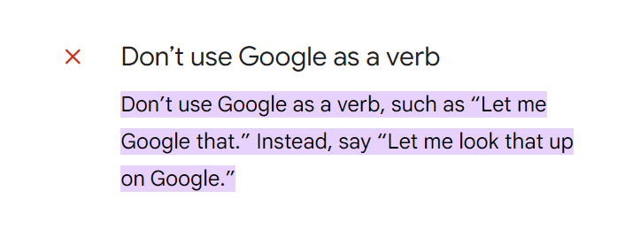
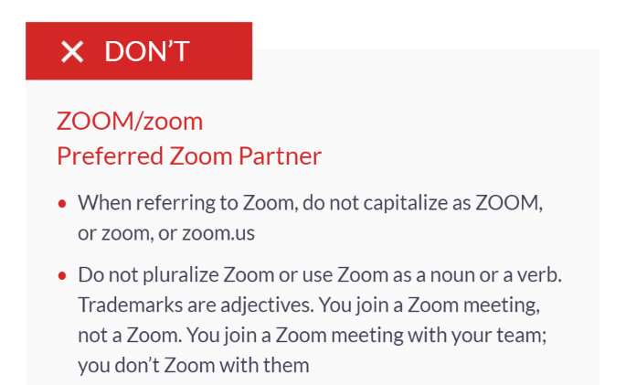

My department is moving to a different building, with our offices undergoing renovation. The new space features among other amenities, four brand new Zoom rooms. 

    

Clearly, Zoom emerged victoriously as the dominant video conferencing tool here at CMU. A brand name becoming synonymous with the product indicates pervasive market presence.

You don’t Bing it. You Google it.
We used to Skype. Now we Zoom. 

Although this highlights the ubiquitousness of the brand, there lurks a danger. When a trademark evolves into a generic term, it becomes vulnerable to genericide—a phenomenon where the brand name is so commonly used in everyday language that it loses its exclusive legal protection. This occurred with [kerosene, bubble wrap, chapstick, and so on](https://en.wikipedia.org/wiki/List_of_generic_and_genericized_trademarks).

So while the [Oxford English Dictionary](https://www.oed.com/dictionary/google_v2) acknowledges ‘google’ as a verb, Google itself really prefers that you refrain from using it that way, as evidenced by its brand guidelines. And so does Zoom.

    <a href="https://about.google/brand-resource-center/guidance/media/" target="_blank">
    

    <a href="https://issuu.com/aimeddesigns/docs/zoom-2022" target="_blank">
    

